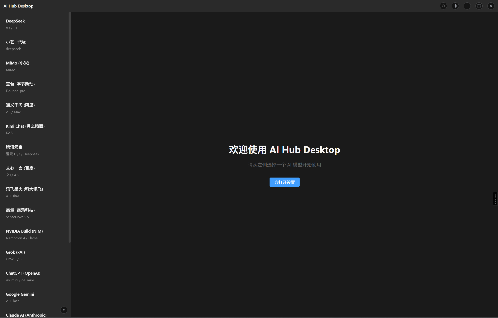
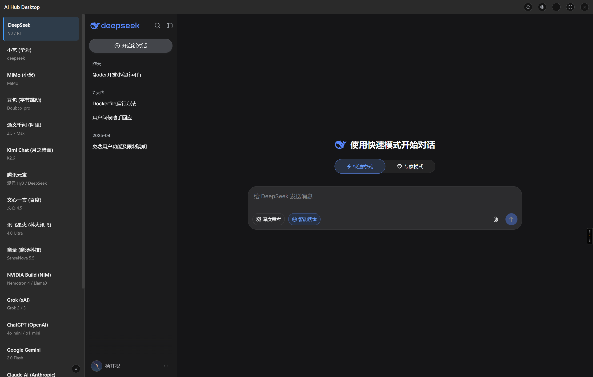
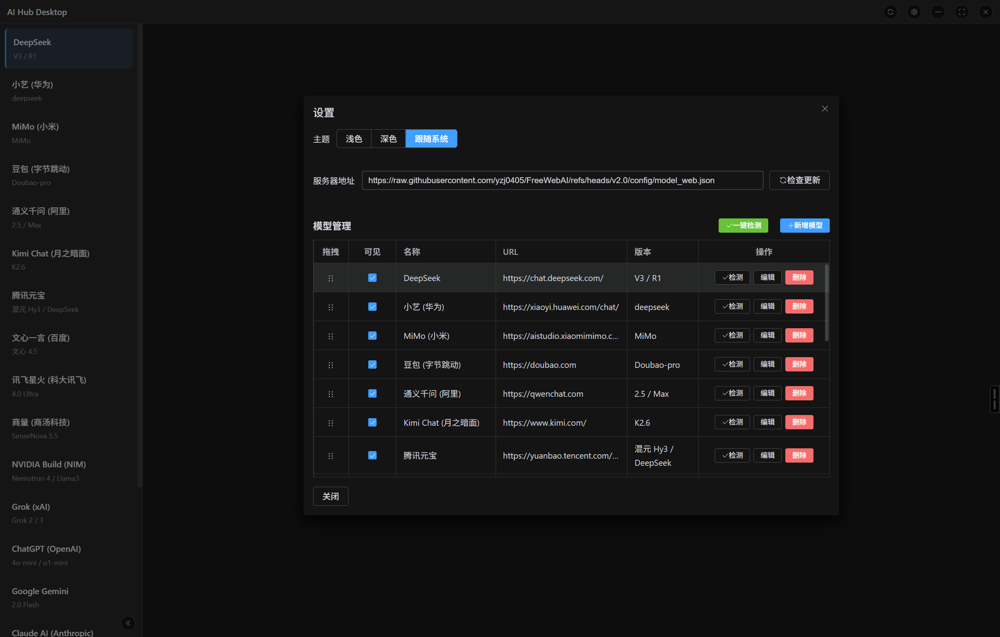

# AI Hub Desktop

> AI 模型网页端整合桌面客户端 — 一个窗口，一键切换所有 AI 对话平台。

## 界面预览






## 功能特性

- **19 个内置模型** — 覆盖国际与国内主流 AI 平台，左侧一键切换
- **原生 WebView 嵌入** — Tauri 2.x 原生 WebView 渲染，完整网页体验，Cookie/登录态隔离
- **深色/浅色/跟随系统** — 三种主题模式，自动响应 `prefers-color-scheme`
- **侧边栏折叠** — 收起后模型名称自动缩写为首字母，动画平滑
- **模型自由管理** — 增删改查、自定义 URL、可见性开关、一键检测可用性
- **云端同步** — 默认拉取 GitHub 远程模型列表，本地可见性状态保留
- **加载过渡机制** — 切换模型时显示 loading 动画，超时/失败显示错误提示 + 重试
- **刷新按钮** — 标题栏一键刷新当前模型页面
- **无框窗口** — 自定义标题栏，最大化/最小化/关闭，居中显示

## 技术栈

| 层级 | 技术 |
|------|------|
| 桌面框架 | Tauri 2.x |
| 视图嵌入 | 原生 WebView（`WebviewBuilder::add_child`） |
| 前端 | Vue 3 + Composition API + TypeScript |
| UI 组件库 | Element Plus 2.14+ |
| 构建工具 | Vite 6 |
| 打包 | Tauri Bundler（MSI / NSIS） |
| 后端 | Rust（serde, reqwest, tokio） |
| IPC | `#[tauri::command]` + `@tauri-apps/api` |

## 快速开始

### 环境要求

- **Node.js** ≥ 18
- **pnpm** ≥ 8（推荐）
- **Rust** ≥ 1.70（[安装指南](https://www.rust-lang.org/tools/install)）
- **Windows 10+ / macOS 11+**

```bash
# 安装前端依赖
pnpm install

# 开发模式（Vite + Tauri 并行启动）
pnpm tauri dev
```

## 构建

```bash
# 构建生产版本（自动打包为安装程序）
pnpm tauri build
```

输出目录：`src-tauri/target/release/bundle/`

- Windows: `nsis/*.exe` 或 `msi/*.msi`
- macOS: `dmg/*.dmg` 或 `macos/*.app`

## 配置

配置文件位于系统应用数据目录，首次运行时自动生成：

| 系统 | 路径 |
|------|------|
| Windows | `%APPDATA%\com.aihub.desktop\model_config.json` |
| macOS | `~/Library/Application Support/com.aihub.desktop/model_config.json` |

配置结构：

```json
{
  "theme": "system",
  "serverUrl": "https://raw.githubusercontent.com/yzj0405/FreeWebAI/refs/heads/v2.0/config/model_web.json",
  "sidebarCollapsed": false,
  "models": [
    {
      "id": "deepseek",
      "name": "DeepSeek",
      "url": "https://chat.deepseek.com/",
      "version": "V3 / R1",
      "visible": true
    }
  ]
}
```

### 云端同步

在设置界面输入服务器地址（默认 GitHub 远程 JSON），点击「检查更新」即可从远程拉取模型列表。合并策略：

- 本地已存在的模型：**保留 visible 状态**，覆盖 name / url / version
- 远程新增的模型：自动加入，默认 `visible: true`
- 远程已删除的模型：从本地剔除

## 内置模型

### 国际平台

| 模型 | 地址 |
|------|------|
| ChatGPT (OpenAI) | chatgpt.com |
| Google Gemini | google.com |
| Claude AI (Anthropic) | claude.ai |
| Microsoft Copilot | m365.cloud.microsoft/chat |
| Grok (xAI) | grok.com |
| Meta AI | meta.ai |
| Mistral Le Chat | mistral.ai |
| NVIDIA Build (NIM) | build.nvidia.com |
| Perplexity AI | perplexity.ai |

### 国内平台

| 模型 | 地址 |
|------|------|
| DeepSeek | chat.deepseek.com |
| 豆包 (字节跳动) | doubao.com |
| 小艺 (华为) | xiaoyi.huawei.com |
| MiMo (小米) | aistudio.xiaomimimo.com |
| 腾讯元宝 | yuanbao.tencent.com |
| 文心一言 (百度) | yiyan.baidu.com |
| 通义千问 (阿里) | qwenchat.com |
| Kimi Chat (月之暗面) | kimi.com |
| 讯飞星火 (科大讯飞) | xinghuo.xfyun.cn |
| 商量 (商汤科技) | chat.sensetime.com |

## 架构设计

```
┌──────────────────────────────────────────────────┐
│  标题栏 (Vue / HTML)                              │
│  [AI Hub Desktop]  [🔄 ⚙ ─ □ ✕]                  │
├──────────┬───────────────────────────────────────┤
│ 侧边栏    │  内容区域                              │
│ (Vue)    │  ┌─────────────────────────────────┐  │
│          │  │  WebView (原生层)                │  │
│ DeepSeek │  │  https://chat.deepseek.com      │  │
│ ChatGPT  │  │                                 │  │
│ Gemini   │  │  Chromium 渲染完整网页          │  │
│ ...      │  │  ↑ on_page_load 事件回调        │  │
│          │  └─────────────────────────────────┘  │
└──────────┴───────────────────────────────────────┘
```

### 分层说明

- **标题栏 / 侧边栏** — Vue 3 渲染的 HTML 层，负责导航、控制、弹窗
- **内容区域** — Tauri 原生 WebView 子视图，渲染在 HTML 层之上，独立进程沙盒
- **切换模型** — 销毁旧 WebView → 创建新 WebView → `on_page_load` 事件通知前端 → 隐藏 loading
- **IPC 通道** — `get_config` / `save_config` / `sync_from_cloud` / `load_content_webview` / `resize_content_webview` / `hide_content_webview` 等

## 项目结构

```
FreeWebAI/
├── src/                          # Vue 3 前端
│   ├── App.vue                   # 主界面：侧边栏、内容区、标题栏
│   ├── main.ts                   # Vue 入口
│   ├── components/
│   │   └── Settings.vue          # 设置弹窗：模型管理、主题、云端同步
│   ├── utils/
│   │   ├── tauri-api.ts          # Tauri IPC 封装
│   │   └── theme.ts              # 主题系统（浅色/深色/跟随系统）
│   └── assets/
│       └── vue.svg
├── src-tauri/                    # Rust 后端
│   ├── src/
│   │   ├── lib.rs                # Tauri Builder + IPC 注册
│   │   ├── main.rs               # 程序入口
│   │   ├── config.rs             # 配置管理、默认模型、云端同步
│   │   └── commands.rs           # Tauri 命令（配置/窗口/WebView）
│   ├── capabilities/
│   │   └── default.json          # 安全权限配置
│   ├── icons/                    # 应用图标（多尺寸）
│   ├── tauri.conf.json           # Tauri 主配置
│   └── Cargo.toml                # Rust 依赖
├── config/
│   └── model_web.json            # 云端远程模型配置
├── doc/                          # 界面截图
├── package.json                  # 前端依赖
└── vite.config.ts                # Vite 构建配置
```

## 版本历史

- **v2.0** — 基于 Tauri 2.x 完全重写，体积大幅缩小，原生 WebView 内嵌，加载过渡优化
- **v1.0** — 基于 Electron 30，WebContentsView 嵌入，基础功能实现

## License

MIT
