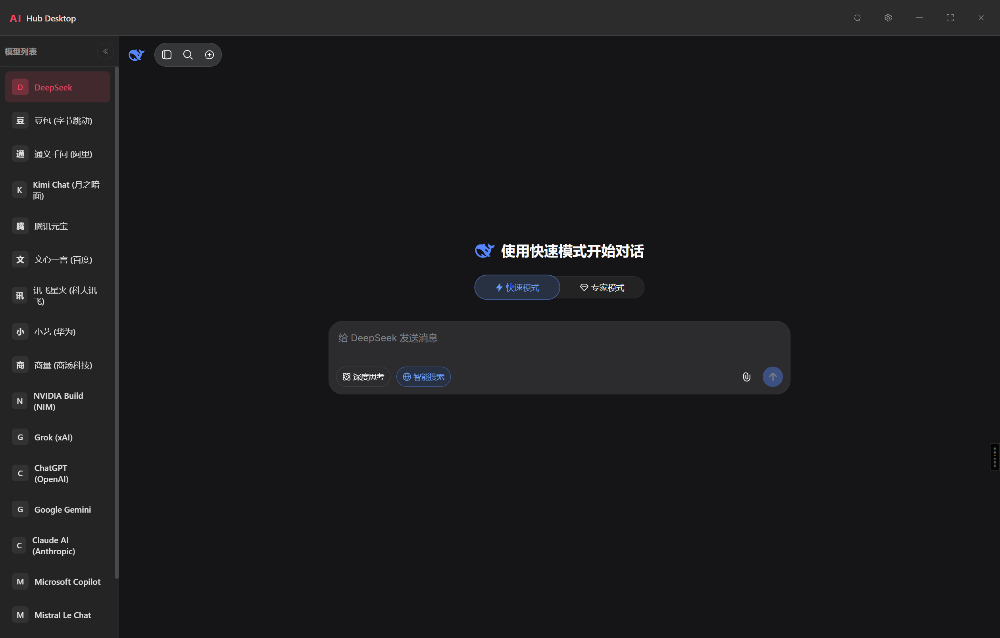
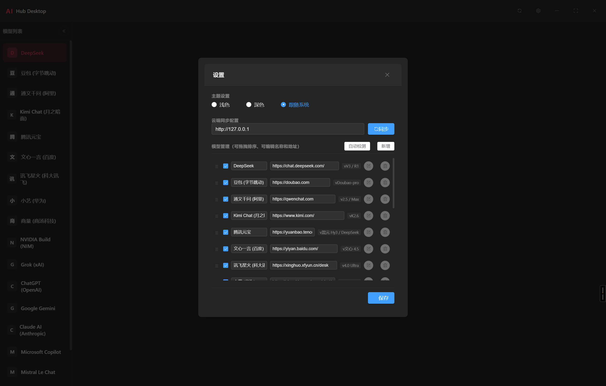

# AI Hub Desktop

> 多大模型网页端整合桌面客户端 — 一个窗口，访问所有 AI 对话平台。

## 界面




## 功能

- **18 个内置模型** — 覆盖国际与国内主流 AI 平台，一键切换
- **WebContentsView 嵌入** — 原生 Chromium 渲染，完整网页体验，Cookie/登录隔离
- **深色/浅色/跟随系统** — 三种主题模式，自动同步 `prefers-color-scheme` 到网页
- **拖拽排序** — 在设置中自由拖拽调整模型顺序
- **模型自由管理** — 增删改查，自定义 URL，可见性开关
- **云端同步** — 配置云端服务器地址，拉取并合并远程模型列表
- **加载状态反馈** — 首次加载显示 loading 动画，超时/失败显示中文错误页与重试按钮
- **无框窗口** — 自定义标题栏，最大化/最小化/关闭

## 技术栈

| 层级 | 技术 |
|------|------|
| 桌面框架 | Electron 30 |
| 视图嵌入 | WebContentsView（原生 Chromium） |
| 前端 | Vue 3 + Composition API |
| UI 组件库 | Element Plus |shuo'm
| 构建 | Vite 5 |
| 打包 | electron-builder（NSIS） |
| IPC | contextBridge + ipcRenderer/ipcMain |

## 项目结构

```
FreeWebAI/
├── src/
│   ├── main/                    # Electron 主进程
│   │   ├── index.js             # 窗口创建、WebContentsView 管理、IPC 注册
│   │   ├── configManager.js     # 配置读写、云端同步、默认模型定义
│   │   └── preload.js           # contextBridge 安全暴露 API
│   └── renderer/src/            # Vue 3 渲染进程
│       ├── App.vue              # 主界面：侧边栏、内容区、标题栏
│       ├── main.js              # Vue 入口
│       ├── components/
│       │   └── Settings.vue     # 设置弹窗：拖拽排序、编辑、主题切换
│       └── assets/
│           └── styles.css       # CSS 变量主题系统
├── index.html                   # HTML 入口
├── vite.config.js               # Vite 构建配置
├── package.json                 # 依赖与 electron-builder 配置
└── .npmrc                       # npm 镜像配置
```

## 快速开始

```bash
# 安装依赖
npm install

# 开发模式（Vite + Electron 并行启动）
npm run dev
```

## 构建

```bash
# 打包为 Windows 安装程序
npm run build
```

输出目录：`dist-electron/`

## 配置

配置文件位于 `%APPDATA%/ai-hub-desktop/model_config.json`，首次运行时自动生成，结构如下：

```json
{
  "theme": "system",
  "serverUrl": "",
  "models": [
    {
      "id": "deepseek",
      "name": "DeepSeek",
      "url": "https://chat.deepseek.com/",
      "version": "V3 / R1",
      "visible": true
    }
  ]
}
```

也可通过设置界面的「云端同步」输入服务器地址，从远程拉取并合并模型列表。

## 内置模型

### 国际平台

| 模型 | 地址 |
|------|------|
| NVIDIA Build (NIM) | build.nvidia.com |
| Grok (xAI) | grok.com |
| DeepSeek | chat.deepseek.com |
| ChatGPT (OpenAI) | chatgpt.com |
| Google Gemini | google.com |
| Claude AI (Anthropic) | claude.ai |
| Microsoft Copilot | microsoft.com |
| Mistral Le Chat | mistral.ai |
| Meta AI | meta.ai |
| Perplexity AI | perplexity.ai |

### 国内平台

| 模型 | 地址 |
|------|------|
| 豆包 (字节跳动) | doubao.com |
| 小艺 (华为) | huawei.com |
| 腾讯元宝 | tencent.com |
| 文心一言 (百度) | baidu.com |
| 通义千问 (阿里) | qwenchat.com |
| Kimi Chat (月之暗面) | moonshot.cn |
| 讯飞星火 (科大讯飞) | xfyun.cn |
| 商量 (商汤科技) | sensetime.com |

## 架构说明

```
┌──────────────────────────────────────────────┐
│  标题栏 (HTML/CSS)                            │
│  [AI Hub Desktop]    [🔄 ⚙ ─ □ ✕]            │
├──────────┬───────────────────────────────────┤
│ 侧边栏    │  内容区域                          │
│ (HTML)   │  ┌─────────────────────────────┐  │
│          │  │  WebContentsView (原生层)    │  │
│ DeepSeek │  │  https://chat.deepseek.com   │  │
│ ChatGPT  │  │                              │  │
│ Gemini   │  │  Chromium 内嵌网页            │  │
│ Claude   │  └─────────────────────────────┘  │
│ ...      │                                    │
└──────────┴───────────────────────────────────┘
```

- **侧边栏**与**标题栏**为 Vue 3 渲染的 HTML 层，负责导航与控制
- **内容区域**为 `WebContentsView` 原生 Chromium 视图，渲染在 HTML 层之上
- 切换模型时，旧视图从 `contentView` 移除（不销毁），新视图创建/恢复
- IPC 通道：`config:get/save`、`view:switch/reload/reloadUrl`、`theme:set`、`view:state`


1.0版本基于electron完成基础的功能

TODO：
2.0版本
基于Tauri重新构建，减小软件大小
增加本地wenUI,添加自定义模型接口


# 创建缓存目录
$cacheDir = "$env:LOCALAPPDATA\electron-builder\Cache\winCodeSign"
New-Item -ItemType Directory -Force -Path $cacheDir | Out-Null

# 从 npmmirror 下载（国内可访问）
$url = "https://registry.npmmirror.com/-/binary/electron-builder-binaries/winCodeSign-2.6.0/winCodeSign-2.6.0.7z"
$out = "$cacheDir\winCodeSign-2.6.0.7z"
Invoke-WebRequest -Uri $url -OutFile $out -UseBasicParsing


& "C:\Program Files\7-Zip\7z.exe" x "$cacheDir\winCodeSign-2.6.0.7z" -o"$cacheDir" -y


%LOCALAPPDATA%\electron-builder\Cache\winCodeSign\winCodeSign-2.6.0\
    ├── darwin\
    ├── linux\
    └── windows-10\
        └── x64\
            ├── rcedit-x64.exe   ← 关键文件
            └── ...